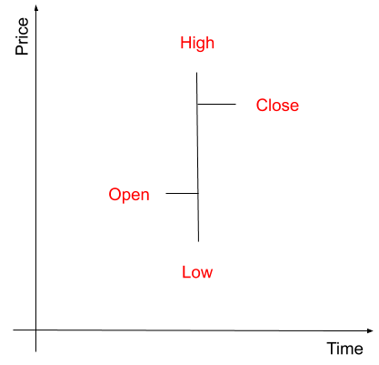

## ABout this guide
*This guide will make you build a trading bot from scratch. A trading bot is a computer program that can automatically place orders to a market or exchange without the need for human intervention.*

## Introduction to cryptocurrency Trading

### What is Trading ?
Trading simply means “exchanging one item for another”. In the financial markets, it’s actually buying shares, futures, options, swaps, bonds etc… or like in our case, an amount of cryptocurrency.

The idea here is to buy cryptocurrency at a certain price and sell it at a higher price to make profits (even if you can still make a profit if the price goes down).

### What is an exchange ?
There are more than 1000 exchanges where you can buy and sell cryptocurrencies today. 

Most exchanges offer API for trading like the coinbase API. Thanks to this, instead of spending hours trading in front of your computer, you can write a program that trades for your. That’s the goal of this tutorial.
                                                                                      
One last point, some exchanges offer sandbox which allows you to trade on the “simulated platform” with fake assets. In this tutorial, we will use kucoin.

### What is a ticker ?
A ticker, synonym for stock symbol, is the short form of full security (asset) name (e.g. full: Bitcoin, ticker: BTC). A ticker has a stream of quotes (AKA prices) attached to it, continuously updated throughout a trading session by the various exchanges.

A description of the fields you can usually found in a ticker is [here](https://trading-bot.cassandre.tech/trading_basics_what_is_a_ticker.html) 

You can get the ticker of ETH-BTC by calling this address : [https://api.kucoin.com/api/v1/market/orderbook/level1?symbol=ETH-BTC](https://api.kucoin.com/api/v1/market/orderbook/level1?symbol=ETH-BTC).

If you have installed [wget](https://www.gnu.org/software/wget/) and [jq](https://stedolan.github.io/jq/) : `wget -q -O - https://api.kucoin.com/api/v1/market/orderbook/level1?symbol=ETH-BTC | jq`

The result is : 
```xml
{
  "code": "200000",
  "data": {
    "sequence": "1583442609331",
    "bestAsk": "0.024988",
    "size": "0.0282784",
    "price": "0.024987",
    "bestBidSize": "3.3342007",
    "time": 1591196236012,
    "bestBid": "0.024987",
    "bestAskSize": "8.5069518"
  }
}
```
at iThis means the price for an ETH is 0.024987 BTC.

## Technical analysis

### Introduction
Technical analysis (often referred to by ‘charting’, ‘market timing’ or ‘trend following’) is the study of price behavior in financial markets in order to forecast the next movement. The goal is to identify the market sentiment : optimistic (bullish), pessimistic (bearish) or uncertain.

The key idea is that prices move in trends most of the time. These trends can be identified with patterns you see repeatedly and with support and resistance trend lines. Primary trends (lasting months or years) are punctuated by secondary movements (lasting weeks or months) in the opposite direction of the primary trend. 

Technical analysis is the art of identifying the behaviour of other traders and take advantage of it.

For example, the herd reacts to a news coming, for example, from Twitter, and they start to interpret it to buy or sell an asset. This will make the price go up or down, and we will want to join the crowd to take advantage of this momentum.

Follow this link to read a more detailed explanation of [what is technical analysis](https://trading-bot.cassandre.tech/technical_analysis_overview.html).

### How does it look like ?
On a chart, the horizontal axis is time, and the vertical axis is the price. The price is presented as a bar representing a time interval, showing :
 * Open : the price at which a security first trades during that time interval.
 * High : the highest price at which a stock traded during the time interval.
 * Low : the lowest price at which a stock trades over the course of a time interval.
 * Close : the final price at which it trades for that time interval.
 
This is how it looks like :



After adding bars to this chart, you can draw lines to forecast future prices. For example, you can draw a line connecting the highest prices, expecting other traders will sell at this point.

### Indicators
Indicators are a way to identify and measure market sentiment without using your emotions. Their goal is to identify conditions by separating the signal from the noise.

At a very basic level, an indicator is a line, or a set of lines that you put on a chart to identify events that allows you to clarify and enhance your perception of the price move.

Assets’ prices are sometimes trending, meaning they have a “direction” during a certain period. Indicators can help you anticipate and see a trend, for example :

 * A trend is beginning : Moving Average Crossover Indicator.
 * A trend is strong or weak : Slope of linear regression.
 * A trend is ending : Breakout pattern.

*note : Most indicators have a range of time in which research shows they work best.*

Indicators give buy and sell signals. 

## Create your bot

### Development tools
If you are running Ubuntu like I do, this is what tools to install : 

 * [Git](https://git-scm.com/) : `sudo apt-get -y install git`
 
 * [Java](https://openjdk.java.net/install/) : `sudo apt-get -y install openjdk-11-jdk`
 
 * [Maven](https://maven.apache.org/) : `sudo apt-get -y install maven`
 
 * Useful tools (Optional) : `sudo apt-get -y install gnuplot wget jq`

### Create a Kucoin account (sandbox)
To test our bot, we will create a sandbox account, it will behave like a real account (assets, tickers, orders, API...) but, of course, with fake assets.

 * Go to [Kucoin sandbox](https://sandbox.kucoin.com/ucenter/signup) and create an account.
 * Move your assets (ETH, BTC...) from your main account to your trading account (Click on [Main Account](https://sandbox.kucoin.com/assets/main-account) link and then click on `transfer` in front of the corresponding cryptocurrency).
 * Click on your profile on the top right of the screen and then `API management`, you will have to setup security before accessing the `create API` menu.
 * Choose an API Name and API Passphrase. In the following configuration screen, set permissions to `̀General` and `Trade` and IP limit to `No Limit`.
 
This will give you the required credentials for our bot : 

| Name  | Description  |
|-------|---------|
| exchange.username  | tutorial.trading.bot@cassandre.tech  |
| exchange.passphrase  | dcLTbWM7ntsX7ih  |
| exchange.key  | 5ed7f8d63118a80006ba9600  |
| exchange.secret  | 5e750039-465f-4ec4-abf0-cc6b9d04beb0  |

### Create your bot
We are going to use [Cassandre trading bot framework](https://trading-bot.cassandre.tech/index.html), a spring boot stater we developed to automatically deal with exchanges, accounts, tickers, orders, strategy...

You can create your bot thanks to our archectype with this simple command line :

```
mvn 	-B archetype:generate \
	-DarchetypeGroupId=tech.cassandre.trading.bot \
	-DarchetypeArtifactId=cassandre-trading-bot-spring-boot-starter-basic-ta4j-archetype \
	-DarchetypeVersion=1.0.1-SNAPSHOT \
	-DgroupId=tech.cassandre.trading.bot.tutorial.ta \
	-DartifactId=crypto-trading-bot-tutorial \
	-Dversion=1.0-SNAPSHOT \
	-Dpackage=tech.cassandre.trading.bot.tutorial.ta
```

This will create a directory `crypto-trading-bot-tutorial` with the sources. 

You can run your bot by typing : `mvn spring-boot:run` and you can package it with the command : `mvn package`.

### Set bot parameters

### How the bot works

## Create your strategy

### Add time series
### Add indicators
### Build a trading strategy

## Test your strategy
### Backtesting
### Forward Testing
### Live Testing

## Deploy
### Release management
### Release as a docker image
### Release deployment